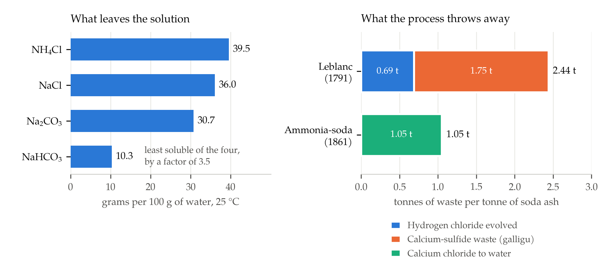

Widnes in the 1860s was a town you could locate by smell from the far side of the Mersey. Hedgerows on the Cheshire bank came out in spring already brown at the edges; ironwork rusted at a speed that struck visitors as supernatural; and the chimneys of the alkali works exhaled a gas that turned to hydrochloric acid on contact with anything damp, including leaves, laundry and lungs. When the Earl of Derby laid the Alkali Inspector's report before the House of Lords in May 1865, he reached for a demonstration that carried better than a table: flowers exposed to quantities of the gas too small to notice had looked healthy for a fortnight, then died within two hours [1].

The arithmetic was worse than the flowers. England, Derby reported, was decomposing 5,762 tons of common salt every week, and before the law arrived roughly a thousand tons a week of muriatic acid — hydrogen chloride — had simply gone up the stacks. He gave the equivalent in the trade's own units: 4,000 tons a week of twenty-five per cent acid [1]. The two figures agree exactly, which is a good sign in a nineteenth-century parliamentary statistic, and the stoichiometry ties them to the salt: 5,762 tons of salt yields about 3,595 tons of hydrogen chloride, so on a comparable throughput the escape was running at something close to twenty-eight per cent of everything the trade made.

None of this was an accident or a malfunction. The acid was not a spill; it was the process working exactly as designed. Britain's chemical industry had been built on a reaction whose second output had no market, and the story of what happened next — a statute with a number in it, then a rival process that rerouted the chemistry to avoid the problem — is industrial history's clearest case of a question every technology eventually faces: what happens to the part of the reaction nobody wants.

## The Cost of Cheap Alkali

Alkali means sodium carbonate, washing soda, soda ash: the substance that makes glass, soap, textiles and paper possible, and which for most of history came from burnt seaweed and the ash of desert plants. Demand grew faster than plants could be burned. In 1775 the Académie des Sciences in Paris offered 2,400 livres for a practical way to make soda from common salt, which is chemically the obvious feedstock and was already cheap [2].

Nicolas Leblanc, a surgeon in the household of the Duke of Orléans, had a working scheme by 1787 and a patent in 1791, and built a works at Saint-Denis with his patron's money [2]. The patron was guillotined in 1793, the factory was confiscated, and the prize was never paid — a case now cited in the economics of innovation as a canonical failure of prize incentives: Leblanc met the conditions and collected nothing [3]. He shot himself in 1806. His process went on to supply the industrial world for a century.

It ran in two stages. Salt was treated with sulfuric acid to give sodium sulfate — "salt cake" — and hydrogen chloride:

$$
2\,\mathrm{NaCl} + \mathrm{H_2SO_4} \longrightarrow \mathrm{Na_2SO_4} + 2\,\mathrm{HCl}
$$

The salt cake was then roasted with limestone and coal in a reverberatory furnace to give "black ash", from which the soda was leached out with water [4]:

$$
\mathrm{Na_2SO_4} + \mathrm{CaCO_3} + 2\,\mathrm{C} \longrightarrow \mathrm{Na_2CO_3} + \mathrm{CaS} + 2\,\mathrm{CO_2}
$$

Read the equations as a materials ledger and the industry's two notorious waste streams fall out of them. Per tonne of soda ash the first stage evolves 0.69 tonnes of hydrogen chloride gas, and the second leaves 0.68 tonnes of calcium sulfide behind in the spent black ash. That residue, sluiced out with water, was the black, stinking, self-heating sludge the trade called galligu, tipped in heaps that reached four and a half million tons in Lancashire alone by 1885 and were still being excavated in the 1980s [5]. Galligu was reported at about 1.75 tonnes per tonne of soda and at roughly forty per cent calcium sulfide when fresh [5] — and 0.68 divided by 1.75 is 38.9 per cent, so two independent numbers, one from stoichiometry and one from the tip, land on the same composition.

## Ninety-Five Per Cent

What made the acid intolerable was not that it was hard to capture. William Gossage had shown in 1836 that hydrogen chloride could be absorbed almost completely by trickling water down a tower packed with brushwood or coke [4]. The technology existed for a generation before the law did. What was missing was any reason to install it: absorbed acid was a liability to be disposed of, and a tall chimney was free.

The Alkali Act of 1863 supplied the reason, and it did so with a number. Alkali works were required to condense at least ninety-five per cent of the muriatic acid gas they evolved — a figure carried forward verbatim into the consolidating statute of 1906, which also states the limit that the escaping gases must "not contain more than one-fifth part of a grain of muriatic acid" per cubic foot of air [6]. Enforcement went to a new professional inspectorate under the Manchester chemist Robert Angus Smith, with four sub-inspectors, a right of entry, and a working philosophy closer to consultancy than prosecution: Smith preferred to tell manufacturers how to comply, and was reluctant to prosecute even when instructed to [7].

It worked, and quickly. By February 1865, Derby told the Lords, average condensation across the trade stood at 98.72 per cent; weekly escape had fallen from 4,000 tons of acid to forty-three; and of sixty-four works inspected, thirty-three were releasing nil or a tenth of a per cent, ten were under one per cent, and only five exceeded four [1]. A single year of inspection had removed roughly ninety-nine per cent of a national emission.

:::think Before reading on
A rule of the form "condense at least ninety-five per cent" is a ratio. Name two things it fails to control even when every works in the country obeys it.
:::

It controls neither the concentration of what escapes nor the absolute quantity. A works that doubles output while holding at ninety-five per cent doubles its emission, and a chimney can meet the ratio while discharging a plume of any concentration the arithmetic permits. Both gaps were visible from the start, which is why the amending legislation of 1874 added the volumetric test — a limit per cubic foot rather than per tonne produced — and extended the regime to sulfur and nitrogen oxides [7]. That shift, from a ratio owed by a process to a concentration owed by a chimney, is the shape almost every modern air-quality standard still takes.

The Victorian limit is also directly comparable with a contemporary one, which makes for a bracing conversion. One-fifth of a grain per cubic foot is 458 milligrams per cubic metre. The European Union's current best-available-techniques range for gaseous chlorides in chemical-sector waste gas is 1 to 10 milligrams per normal cubic metre [8]. Britain's first statutory limit on the concentration of an industrial gas was, on its own units, between forty-six and four hundred and fifty times looser than what a chemical plant is expected to achieve today — and it still cut national emissions by two orders of magnitude, because the counterfactual was not a tighter rule but no rule.

## The Uphill Reaction

While inspectors were metering chimneys in Lancashire, a young Belgian was making the whole problem obsolete by routing around it. The prize the Académie had offered in 1775 was, in effect, a request to convert salt and limestone into soda. Written as a single reaction that is:

$$
2\,\mathrm{NaCl} + \mathrm{CaCO_3} \longrightarrow \mathrm{Na_2CO_3} + \mathrm{CaCl_2}
$$

and it does not go. From tabulated standard Gibbs energies of formation the change is about +104 kilojoules per mole of soda, so the dry reaction is thermodynamically forbidden [9]. In water it is worse than forbidden — it runs briskly backwards, because calcium carbonate is the least soluble species in the mixture and precipitates out. That reverse reaction is the lime-soda softening used to take hardness out of municipal water. Leblanc's detour through sulfuric acid was not clumsiness. It was the price of getting round a wall.

Ernest Solvay's insight, patented on 15 April 1861, was that a third substance could carry the reaction over the wall and then be recovered unchanged. Saturate brine with ammonia, pass in carbon dioxide, and sodium bicarbonate crystallises out:

$$
\mathrm{NaCl} + \mathrm{NH_3} + \mathrm{CO_2} + \mathrm{H_2O} \longrightarrow \mathrm{NaHCO_3} + \mathrm{NH_4Cl}
$$

Calcine the bicarbonate and you have soda ash, with half the carbon dioxide returned to the front of the plant:

$$
2\,\mathrm{NaHCO_3} \xrightarrow{\ \Delta\ } \mathrm{Na_2CO_3} + \mathrm{CO_2} + \mathrm{H_2O}
$$

The reason it works at all is a single number. At 25 °C, sodium bicarbonate dissolves to 10.3 grams per hundred of water, against 36.0 for sodium chloride, 39.5 for ammonium chloride and 30.7 for sodium carbonate [9]. In a liquor holding all four ions, the bicarbonate is the one that has no choice but to leave, by a factor of three and a half over its nearest rival. Solvay's process rests on exactly that dependence, the low solubility of bicarbonate in an ammoniacal solution [10]. The wall in the thermodynamics is climbed by removing the product from the equilibrium — not by pushing harder, but by giving the reaction somewhere to fall.

None of the chemistry was new. The reaction had been noticed by Fresnel in 1811, and Dyar and Hemming in Britain in 1838, and Schloesing and Rolland in France in 1854, all tried to build on it and all abandoned the attempt [10]. What Solvay contributed was not the reaction but the recovery: the ammonia had to come back. Treating the ammonium chloride with lime regenerates it and produces the process's own waste stream:

$$
2\,\mathrm{NH_4Cl} + \mathrm{Ca(OH)_2} \longrightarrow \mathrm{CaCl_2} + 2\,\mathrm{NH_3} + 2\,\mathrm{H_2O}
$$

:::think A number worth estimating
Ammonia appears in the first reaction and comes back in the last, so the net process neither consumes nor produces it. How much ammonia must circulate per tonne of soda ash, and how good does the recovery have to be before the ammonia bill destroys the business?
:::

A tonne of soda ash is 9,435 moles, so two moles of ammonia per mole of product means 321 kilograms of ammonia circulating for every tonne shipped. With recovery fraction $\eta$ and an ammonia price $p$ in dollars per tonne, the loss costs $0.321\,(1-\eta)\,p$ dollars per tonne of soda. Taking recent figures of 485 dollars a metric tonne for ammonia — 440 dollars a short ton [11] — and 220 dollars a tonne for soda ash [12], ninety-nine per cent recovery costs about 1.56 dollars a tonne, or seven-tenths of one per cent of the selling price. Ninety-five per cent costs 7.79 dollars, or three and a half per cent — survivable, but a large bite out of a commodity margin. Fifty per cent recovery costs 78 dollars a tonne, more than a third of the revenue, and no amount of clever chemistry saves a plant from that. The invention that mattered was therefore mechanical: the tall carbonating tower of 1869, with its stacked cylinders and countercurrent flow, and the distillation and absorption train that had to hold a volatile gas inside a continuous circuit for years on end [10].

The economics were decisive once solved: the ammonia-soda route needs no sulfuric acid and no coal as reductant, and throws off no acid gas at all.

| Per tonne of soda ash | Leblanc | Ammonia-soda |
|---|---|---|
| Common salt | 1.10 t | 1.10 t |
| Limestone | 0.94 t | 0.94 t |
| Sulfuric acid | 0.93 t | none |
| Coal as reductant | 0.23 t | none |
| Acid gas evolved | 0.69 t | none |
| Solid waste | 1.75 t | none |
| Chloride to water | none | 1.05 t |

## Why the Dirty Process Refused to Die

By any reading of that table the Leblanc works should have closed in the 1870s. They did not. Britain went on making Leblanc soda into the twentieth century, and the reason is the most instructive part of the episode: the Alkali Act had turned the waste into a product.

Chlorine bleaches, as Scheele had found in 1774, and bleaching powder was the single most valuable input to a cotton industry that dominated British exports. Chlorine came from hydrogen chloride, and after 1863 every alkali works in the country was condensing its hydrogen chloride by law. Two processes turned the captured acid into chlorine: Weldon's of 1866, which recovered and recycled the manganese that oxidation consumed, and Deacon's of 1868, which oxidised hydrogen chloride in air over a copper chloride catalyst [13]. The sulfur in the galligu heaps was attacked in the same spirit, with the Chance-Claus process of 1888 recovering sixty to eighty per cent of it [5].

So the Leblanc works became a joint-product plant. Its soda ash lost money against ammonia-soda; its bleaching powder did not, and could not be made by the Solvay route at all, which produces no chlorine. Forty-five British Leblanc firms merged in 1890 into the United Alkali Company precisely to manage that predicament, in a market where the American tariff mattered enormously — three-fifths of British alkali exports went to the United States in the early 1890s [14]. The combine survived until electrolysis broke the link, by making chlorine and caustic soda directly from brine, and with it the last commercial reason to keep a Leblanc furnace warm.

There is a general lesson here, and it is not a comfortable one. Regulation that forces a waste stream to be captured does not merely reduce pollution; it creates a stock of a substance somebody must now find a use for, and a use, once found, becomes an interest. The condensation towers that saved the Cheshire hedgerows also gave the obsolete process the co-product that let it outlive its own economics by thirty years.

## What Counts as Waste

The ammonia-soda process did not win because it was clean. It won because it was cheaper, and it was cheaper partly because its waste stream was soluble.

That stream is still running. Under current European best-available-techniques guidance, a soda ash plant consumes 1.1 to 1.5 tonnes of limestone per tonne of product — against the 0.94 tonnes stoichiometry requires, the excess covering kiln and process losses — emits 0.2 to 0.4 tonnes of carbon dioxide, and discharges 8.5 to 10.7 cubic metres of distillation waste water per tonne to a watercourse [15]. The same document names the underlying constraint without flinching: the "limited material efficiency of the Solvay process, due to intractable chemical equilibrium limitations" [15]. Put the 1.05 tonnes of calcium chloride into 8.5 to 10.7 cubic metres of water and it is a nine to eleven per cent brine, which is to say roughly a tonne of dissolved salt per tonne of product, going somewhere that is not a chimney.

This is not a marginal technology. World soda ash production in 2024 was about 73 million tonnes, of which 49 million — two-thirds — was synthetic rather than mined from natural trona, with China at 36 million tonnes, the United States at 12 and Türkiye at about 11 [12]. Ernest Solvay's chemistry, essentially unaltered, is still how most of the world's glass and detergent gets its sodium.

The pattern the alkali trade established has proved remarkably durable. A process is adopted for its cost; its unsalable output accumulates until somebody with standing complains; a standard is written against the stream that can be metered at a fixed point; and the industry then either finds a market for the residue or relocates it to a medium where no standard yet applies. Hydrogen chloride was regulated because it arrived at a chimney, in a plume, on a neighbour's crops. Galligu was regulated late and imperfectly because a tip is nobody's air. Dissolved calcium chloride has never been regulated at all in the way muriatic acid was, because a river dilutes it and a diluted thing is politically almost invisible.

Robert Angus Smith understood the general problem better than his statute did. The chemist who wrote Britain's first emission standard spent the rest of his career measuring the chemistry of rain across the industrial north, and in 1872 gave the language the phrase acid rain in a book he subtitled, with some ambition, *The Beginnings of a Chemical Climatology* [16]. He had already learnt the lesson his inspectorate taught: that a number in a statute governs only the stream it names, and that a process under pressure will move its waste to whichever medium is not being counted. It took Europe another century to write the number for rain. Nobody has yet written one for the brine.

## References

1. "Alkali Act — Inspector's Report," *Hansard*, House of Lords Debates, 22 May 1865.
2. "Bicentenary of Nicolas Leblanc," *Nature*, vol. 150, pp. 658-659, 1942, doi: 10.1038/150658e0.
3. B. Z. Khan, "Inventing Prizes: A Historical Perspective on Innovation Awards and Technology Policy," National Bureau of Economic Research, Cambridge, MA, USA, Working Paper 21375, July 2015.
4. M. Sutton, "A revolutionary casualty," *Chemistry World*, Royal Society of Chemistry, London, U.K.
5. P. Reed, "Galligu: An environmental legacy of the Leblanc alkali industry, 1814-1920," *ECG Bulletin*, Environmental Chemistry Group, Royal Society of Chemistry, February 2013.
6. *Alkali, &c. Works Regulation Act 1906*, 6 Edw. 7, c. 14, ss. 1(1) and 6(2), United Kingdom.
7. P. Reed, "Robert Angus Smith and the pressure for wider and tighter pollution regulation," *ECG Bulletin*, Environmental Chemistry Group, Royal Society of Chemistry, January 2012.
8. Commission Implementing Decision (EU) 2022/2427 of 6 December 2022 establishing best available techniques (BAT) conclusions for common waste gas management and treatment systems in the chemical sector, *Official Journal of the European Union*, L 318, pp. 157-196, 2022.
9. W. M. Haynes, Ed., *CRC Handbook of Chemistry and Physics*, 95th ed. Boca Raton, FL, USA: CRC Press, 2014.
10. I. Fechete, "Ernest Gaston Joseph Solvay, a prestigious example of a scientific entrepreneur or *labor omnia vincit improbus*," *Comptes Rendus Chimie*, vol. 19, no. 4, pp. 413-418, 2016, doi: 10.1016/j.crci.2016.02.008.
11. U.S. Geological Survey, "Nitrogen (Fixed) — Ammonia," in *Mineral Commodity Summaries 2025*. Reston, VA, USA: U.S. Geological Survey, 2025.
12. U.S. Geological Survey, "Soda Ash," in *Mineral Commodity Summaries 2025*. Reston, VA, USA: U.S. Geological Survey, 2025.
13. R. Stringer and P. Johnston, "Industrial chlorine manufacture," in *Chlorine and the Environment: An Overview of the Chlorine Industry*. Dordrecht, The Netherlands: Springer, 2001, pp. 1-24.
14. B. D. Varian, "American Tariff Policy and the British Alkali Industry, 1880-1905," Department of Economic History, London School of Economics and Political Science, London, U.K., Economic History Working Paper 189/2014, March 2014.
15. European Commission, *Reference Document on Best Available Techniques for the Manufacture of Large Volume Inorganic Chemicals — Solids and Others Industry*. Seville, Spain: European IPPC Bureau, August 2007.
16. R. A. Smith, *Air and Rain: The Beginnings of a Chemical Climatology*. London, U.K.: Longmans, Green, and Co., 1872.
