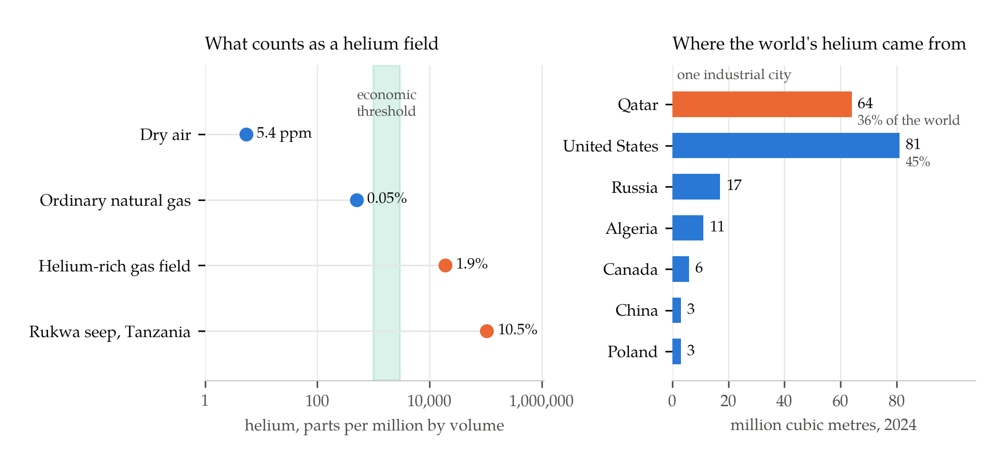

Two hundred cryogenic containers stood at Ras Laffan Industrial City in Qatar in the spring of 2026 with nowhere to go. Each held liquid helium a few degrees above absolute zero inside a vacuum-jacketed vessel, and each was losing its cargo at a rate its insulation had already decided. A full container stays viable for roughly thirty-five to forty-eight days; after that the boil-off has eaten enough of the load to make the voyage pointless. The sea lane out of the Gulf had become impassable, and the containers sat there quietly emptying themselves into the sky [1].

Almost no other commodity behaves this way. Oil in a stranded tanker is still oil a year later. Helium is the one industrial input that leaves — from the vessel, from the atmosphere, from the planet — and the strange architecture of the helium trade is built around that fact, or rather around the industry's long habit of not building around it.

The economy that depends on it has grown into something the trade's structure was never designed to carry. Helium cools the superconducting magnets in every MRI scanner and every nuclear magnetic resonance spectrometer, and purges rocket propellant systems. In semiconductor fabrication it carries heat away from silicon wafers and blankets them against unwanted chemistry, a role for which there is no substitute at any price. In 2024 the United States alone sold eighty-one million cubic metres of it, worth about 1.1 billion dollars, and sent seventeen per cent of domestic consumption into magnetic resonance imaging [2]. It is a small market attached to very large things.

## An Element the Earth Makes Slowly

Helium is not mined so much as inherited. The helium-4 nucleus is an alpha particle, and every alpha particle emitted by a decaying heavy nucleus in the crust eventually picks up two electrons and becomes an atom of helium gas. The three long decay chains do most of the work. Uranium-238 sheds thirty-two mass units on its way to lead-206, which is exactly eight alpha particles:

$$
{}^{238}\mathrm{U} \;\longrightarrow\; {}^{206}\mathrm{Pb} + 8\,{}^{4}\mathrm{He} + 6\,\beta^{-}
$$

Uranium-235 yields seven on the way to lead-207 and thorium-232 yields six on the way to lead-208. The rate depends on nothing but the half-lives and the amount of uranium and thorium present, which is why the best helium ground is old, granitic and radioactive: the Archean and Proterozoic cratons, with thorium running at twenty to thirty parts per million, that form the basement of continents [3].

The rate is also, by industrial standards, absurdly slow. Geologists measuring the extraordinary helium flux venting from Yellowstone benchmarked it against ordinary crust — about 17,100 moles a year beneath the park's nine thousand square kilometres [4]. Scale that per-area rate to the roughly two hundred million square kilometres of continental crust and the whole basement generates on the order of ten million cubic metres of helium a year. The world extracted a hundred and eighty million in 2024 [2]. Humanity is drawing helium out of the ground something like twenty times faster than the continents make it — an order-of-magnitude comparison, not a precise one, but the sign is not in doubt.

Generating the gas is only the first step, and the least interesting one. Helium is the smallest and most mobile atom in the periodic table, and it will not stay put; it has to be swept out of the basement, trapped beneath something impermeable, and concentrated. Nitrogen does the sweeping, both dissolved in groundwater and as a free gas phase, carrying crustal helium into whatever gas cap waits above [3]. Where methane happens to be in that cap, the helium arrives as a passenger in somebody else's natural gas field. That accident is the entire supply chain. The history of helium exploration, as the geologists who study it put it, is one of serendipity — and petroleum companies routinely vent the gas, either not knowing it is there or not valuing it [3].

## Why the Air Is Not a Reserve

The concentration a field needs before helium is worth separating is low in absolute terms and enormous in relative ones. Published thresholds disagree: one review of exploration principles puts the economic floor at 0.1 per cent by volume [3], another at 0.3 per cent [5] — a real gap rather than a rounding difference, since it turns on whether the methane alongside is already being liquefied anyway. Either way, ordinary natural gas at 0.05 per cent does not qualify.

Which raises an obvious question, since helium is not rare in the ordinary sense.

:::think Before reading on
Air contains about 5.4 parts per million of helium by volume. Multiply that by the mass of the atmosphere and the total comes to roughly 21 trillion cubic metres at surface conditions — well over a hundred thousand years of world production, hanging free above every country on Earth. Why does nobody take it?
:::

Because concentration, not quantity, is what separation costs money for. A gas field at the 0.1 per cent threshold is 185 times richer in helium than air; one at 0.3 per cent is 556 times richer; the seeps of the Rukwa Basin in Tanzania, at 10.5 per cent, are nineteen thousand times richer [3]. Every one of those factors is work paid for in compression and cold. Helium is separated from natural gas by cryogenic distillation precisely because everything else in the stream condenses first and helium does not — but you still have to chill the whole stream, and chilling one that is 999,995 parts something else is a losing proposition. The atmosphere is not a reserve; it is a tailings pile.

It is also leaking. Earth's gravity does not hold helium. The classical picture, Jeans escape, has the fastest molecules in the high-altitude tail of the Maxwell distribution simply outrunning the planet, and for helium that channel turns out to be almost negligible: only about one atom in a million leaves that way. The actual exit is the polar wind, the stream of ions flowing out along open magnetic field lines near the poles, which accounts for nearly the entire loss of terrestrial helium — about fifty grams a second [6].

Fifty grams a second sounds trivial and is worth converting. The atmosphere holds roughly 3.8 billion tonnes of helium and loses about 1,580 tonnes a year, so the residence time of a helium atom in the air is

$$
\tau = \frac{M_{\mathrm{He}}}{\Phi} = \frac{3.8 \times 10^{12}\ \mathrm{kg}}{1.6 \times 10^{6}\ \mathrm{kg\,yr^{-1}}} \approx 2.4 \times 10^{6}\ \mathrm{yr}
$$

A couple of million years — geologically brief, and the reason the atmospheric abundance sits where it does rather than climbing. Helium released anywhere on Earth is gone from the planet on a timescale short compared with the age of the rocks that made it. Every balloon is a small permanent subtraction.

## The Stockpile That Was Sold

The United States understood the strategic logic of this earlier than anyone and then, over ninety years, argued itself out of the conclusion.

Helium's first strategic use was lift. The Mineral Leasing Act of 1920 reserved all helium on federal land to the government, the Helium Act of 1925 built a national programme around it, and the Amarillo plant and the Cliffside gas field went up in 1929 [7]. When Nazi Germany sought American helium for its airships, the refusal became a small diplomatic crisis: through the spring of 1938 the American ambassador in Berlin cabled repeatedly about the stalled export, and the Acting Secretary of State relayed Interior's position that legal and practical questions remained to be resolved before any contract could be expressed [8]. The licence never issued. Helium was an instrument of statecraft before it was an industrial gas.

The 1960 amendments turned the programme inside out. Rather than produce helium itself, the government would buy crude helium from private producers and store it underground at Cliffside, financed by borrowing from the Treasury. The stockpile got built. As a balance sheet it failed: an original principal of about 290 million dollars had compounded into roughly 1.3 billion by September 1991, of which over a billion was accrued interest [9]. Congress had built a strategic reserve and accidentally built a debt.

The Helium Privatization Act of 1996 resolved the embarrassment by ordering the stockpile sold — sales to begin by 2005, with a pricing formula pegged to the outstanding debt and the volume in storage, and a permanent floor of 600 million standard cubic feet to be retained [7]. It was a liquidation dressed as a market reform, and the price it produced sat at or below the market [9].

:::think A number worth estimating
The reserve held about 30.5 billion standard cubic feet when the 1996 Act ordered it sold, and 11.44 billion were still in storage in September 2012. Set those against a world that now consumes 180 million cubic metres a year. How much cover was being sold off?
:::

A cubic foot is 0.0283 cubic metres, so 30.5 billion of them is 864 million cubic metres — about 4.8 years of world consumption at today's rate, held in one Texas structure. The 11.44 billion cubic feet still there in 2012 came to 324 million cubic metres, or roughly 1.8 years [9]. At its height the reserve supplied some forty-two per cent of American and thirty-five per cent of global demand for crude helium [7]. Nothing comparable has ever existed for any other industrial gas.

The Helium Stewardship Act of 2013 slowed the disposal and required the remainder to be auctioned and the system sold. On 27 June 2024 the Bureau of Land Management closed the sale of the Federal Helium System to Messer, and 460 million dollars went to the Treasury [10], [2]. Eight months later the strategic case for a buffer stock became unusually easy to explain.

## The Geometry of a Single Strait

Qatar's helium comes out of one place. The Ras Laffan Helium 1 unit started up in 2005 at 700 million standard cubic feet a year; Helium 2 followed in 2013 at 1.3 billion, which its builder rated at about thirty-eight million cubic metres [11], [12]. A third unit followed. Together they made Qatar the world's second-largest producer — sixty-four million cubic metres in 2024, against eighty-one for the entire United States and a world total of a hundred and eighty [2]. Better than a third of world supply, from one industrial city, on one coastline, inside one gulf.

The vulnerability had been demonstrated once already. In June 2017 Saudi Arabia and the UAE severed relations with Qatar and helium exports stopped — not because anything was damaged, but because Qatar's cryogenic containers reached the world by road through Saudi Arabia to the port of Jebel Ali, and that road closed [13]. The industry counts that episode as the third of its four modern shortages, worsened when maintenance outages in Wyoming and Algeria in 2019 pushed the market deficit toward forty per cent [14].

The 2026 shock was of a different kind. Iranian strikes hit Ras Laffan on 2 March and again on 19 March; QatarEnergy declared force majeure and halted production; and the Strait of Hormuz, through which most of Qatar's helium transits, became effectively impassable [1], [15], [16]. How large a shock that was received three different answers, all defensible.

| Figure quoted | What it measures | Source |
|---|---|---|
| 11 per cent of world supply | 30 per cent of Qatar's 2026 volumes, annualised | [1] |
| 14 per cent of exports | annualised cut to helium exports | [16] |
| 5.2 million cubic metres a month | Qatar's entire monthly output, while shut | [15] |

They are not in conflict; they have different denominators. Qatar's sixty-four million cubic metres a year is 5.3 million a month, which is what the third figure represents — a total outage measured while it lasts. The first two annualise a partial-year interruption across the whole of 2026, and thirty per cent of Qatar's thirty-six per cent share is 10.7 per cent of the world, which rounds to the eleven widely quoted. Anyone who wants to know whether a supply shock is serious has to ask which clock the number runs on, because commodity journalism rarely says.

What made this one serious was the absence of anywhere to turn. American production had no spare capacity of that size. Russia, the third supplier, had brought Gazprom's Amur plant online — up to sixty million cubic metres of helium a year across six trains, aimed at Asian markets [17] — but the European Union had banned Russian helium imports in September 2024 [2], and in April 2026 Moscow imposed its own export controls, citing domestic needs including optical fibre for drone control [18]. The two largest alternatives to Qatar were, respectively, tapped out and closed.

## What a Shortage Actually Rations

Helium shortages do not announce themselves the way oil shocks do. Helium reaches most of its users through long-term contracts with a handful of industrial gas companies, so the adjustment happens first as allocation rather than as price, and the people who find out first are the ones with the weakest contracts.

The 2022 shortage is the clearest record of what that looks like. Laboratory chemists watched monthly allocations cut from 2,400 litres to 940 and shut down nuclear magnetic resonance spectrometers, because a magnet that warms up is a magnet that may never come back; one physicist could run only one or two of four scanning tunnelling microscopes. The cost of a hundred-litre dewar of liquid helium roughly doubled in two years [19]. Some universities installed recovery plants — one recovered about seventy per cent of what it used — and at least one supplier, revealingly, asked a customer to sign a commitment *not* to recycle [19].

Prices followed. The USGS put the base price for Grade-A helium at about 14 dollars per cubic metre in 2024 and 12 dollars in 2025, against 7.57 dollars in 2020 [2], [20]; spot prices roughly doubled again in March 2026 [16]. The price can move like that because of the shape of the industry: global supply depends on a handful of countries and fewer than fifteen companies worldwide [20], and demand is dominated by applications that cannot substitute. A party balloon is discretionary. A wafer fab is not, and chip manufacturing is on course to become the largest single application if it is not already [20].

## Exploring for the Byproduct

The structural fix is to stop treating helium as something found by accident while looking for methane, and that work has started. The Rukwa Basin in Tanzania has an independently estimated P50 recoverable resource of 138 billion standard cubic feet — 3.9 billion cubic metres, or about a quarter of current global reserves in one basin [3]. The generative capacity of the Tanzanian Craton beneath it is put at 700,000 billion cubic feet, five orders of magnitude more than the trap holds; the constraint was never how much the rock made, only how much got caught.

Meanwhile the theory needed to prospect deliberately has arrived. Work published in 2023 showed that crustal nitrogen degassing from crystalline basement can, on its own, reach saturation at the base of a sedimentary basin and form a free gas phase into which helium then partitions — no hydrocarbons required [21]. That turns helium exploration from a matter of luck into a matter of mapping nitrogen and old basement, and it opens intracratonic basins that no petroleum geologist ever had reason to drill.

But a new supply province takes a decade, and it does not solve the deeper problem, which is not geological at all. Helium's supply is set almost entirely by decisions made about other things: whether an LNG train runs, whether a pipeline to China fills, whether a strait is open. Its demand is set by MRI scanners and lithography tools that cannot be told to wait. And the one institution that ever held a buffer between the two — a government that spent ninety years accumulating several years of world supply underground, and then, having decided the arrangement was a fiscal mistake, sold the whole thing for 460 million dollars — is out of the business.

The interesting question is not whether that sale was wrong. As public accounting it was defensible, and the reserve had been shrinking under statutory instruction for nearly thirty years before the final transaction. The question is what kind of institution is supposed to hold inventory for a commodity whose economics give nobody a reason to. A private supplier that stockpiles helium is carrying an asset that evaporates, in a market that spends most decades oversupplied and comfortable. The buffer only pays in the years when everything fails at once — which is exactly the property that made governments build strategic reserves in the first place, and exactly the property that makes them so easy to argue away in the long stretches when nothing goes wrong.

## References

1. "Qatari LNG shutdown puts 11% of global helium supply at risk," *Arabian Gulf Business Insight*, 25 March 2026.
2. U.S. Geological Survey, "Helium," in *Mineral Commodity Summaries 2025*. Reston, VA, USA: U.S. Geological Survey, 2025.
3. D. Danabalan, J. G. Gluyas, C. G. Macpherson, T. H. Abraham-James, J. J. Bluett, P. H. Barry, and C. J. Ballentine, "The principles of helium exploration," *Petroleum Geoscience*, vol. 28, no. 2, 2022, doi: 10.1144/petgeo2021-029.
4. J. B. Lowenstern, W. C. Evans, D. Bergfeld, and A. G. Hunt, "Prodigious degassing of a billion years of accumulated radiogenic helium at Yellowstone," *Nature*, vol. 506, pp. 355-358, 2014, doi: 10.1038/nature12992.
5. "On the hunt for helium," *Physics World*, Institute of Physics, Bristol, U.K.
6. D. C. Catling and K. J. Zahnle, "The escape of planetary atmospheres," *Scientific American*, 2009.
7. U.S. Department of the Interior, "Statement on the Federal Helium Program," testimony before the U.S. House Committee on Natural Resources, Washington, DC, USA, 14 February 2013.
8. *Foreign Relations of the United States, Diplomatic Papers, 1938, Volume II*, "Refusal of the United States to sell helium to the German Government for use in zeppelins," documents 365-370, April-May 1938. Washington, DC, USA: U.S. Government Printing Office.
9. U.S. Government Accountability Office, *Helium Program: Urgent Issues Facing BLM's Storage and Sale of Helium Reserves*, GAO-13-351T. Washington, DC, USA: GAO, 2013.
10. Bureau of Land Management, "BLM Helium System sale provides 460 million dollars to U.S. Treasury," press release, U.S. Department of the Interior, Washington, DC, USA, December 2024.
11. QatarEnergy LNG, "Operations — Ras Laffan Helium," Doha, Qatar.
12. Air Liquide Engineering & Construction, "Qatar: start-up of world's largest helium unit," Paris, France.
13. "Qatar blockade highlights fragility of helium supply," *Physics World*, Institute of Physics, Bristol, U.K., 29 June 2017.
14. S. DeCarlo and S. Goodman, "The Impact of Conflict on the Global Helium Shortage," Office of Industries, U.S. International Trade Commission, Washington, DC, USA, Executive Briefing on Trade, May 2022.
15. "Iran war puts 'endangered' helium supplies at risk as Qatar halts exports," *The National*, Abu Dhabi, UAE, 18 March 2026.
16. "Iran War, Hormuz Closure Hit Helium and Semiconductor Supply Chain," *Foreign Policy*, Washington, DC, USA, 27 April 2026.
17. Gazprom, "Amur Gas Processing Plant," project description, St Petersburg, Russia.
18. "Russia places temporary export controls on helium," *gasworld*, Truro, U.K., April 2026.
19. D. Kramer, "Helium is again in short supply," *Physics Today*, American Institute of Physics, College Park, MD, USA.
20. "The era of cheap helium is over — and that's already causing problems," *MIT Technology Review*, Cambridge, MA, USA, 25 February 2024.
21. A. Cheng, B. Sherwood Lollar, J. G. Gluyas, and C. J. Ballentine, "Primary N2-He gas field formation in intracratonic sedimentary basins," *Nature*, vol. 615, no. 7950, pp. 94-99, 2023, doi: 10.1038/s41586-022-05659-0.
