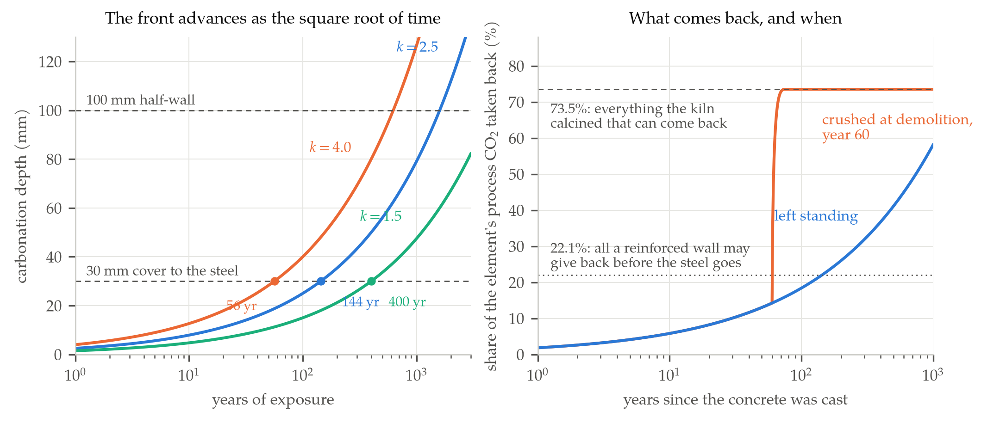

Stand close to a Roman wall and scrape at the mortar between the bricks, and what
comes away under the blade is calcite — the same mineral as the limestone in the
quarry the Romans took it from. The mortar made a round trip. Someone burned
limestone in a wood-fired kiln until it gave up its carbon dioxide, slaked the
resulting quicklime with water, spread the paste between courses of brick, and
then the paste sat in the air for two thousand years quietly reabsorbing exactly
the gas the kiln had driven off. Burn, slake, carbonate, and you are back where
you started. Masons have called it the lime cycle for as long as they have had a
word for it, and it is one of the few genuinely closed loops in the history of
construction materials.

Portland cement broke the loop, and the way it broke it is the whole subject.
A modern cement does not get its strength from carbonation. It gets it from
calcium silicate hydrate, a gel that forms when water attacks the alite and
belite in clinker, and which is perfectly happy never to meet carbon dioxide at
all. The carbon still comes out at the kiln — more of it than ever, from about
4.1 billion tonnes of cement a year — but the material has no structural need to
take it back. It takes some of it back anyway, slowly, and the argument over how
much is currently one of the noisier disagreements in the carbon-cycle
literature, with credible published estimates differing by a factor of nearly
four [6], [8], [10].

## The Half That Never Sees a Flame

The reaction that matters happens before any cement exists. Limestone is calcium
carbonate; clinker needs calcium oxide; the difference is a molecule of carbon
dioxide per molecule of rock, and it leaves as gas.

$$ \mathrm{CaCO_3} \longrightarrow \mathrm{CaO} + \mathrm{CO_2}, \qquad
\frac{M_{\mathrm{CO_2}}}{M_{\mathrm{CaO}}} = \frac{44.01}{56.08} = 0.7848 $$

That ratio is the entire emission factor of the cement industry, and it is not
negotiable by anybody. Clinker is roughly 65 per cent lime by mass, so each tonne
of it carries 0.65 tonnes of CaO that used to be carbonate, and releasing that
much lime releases $0.65 \times 0.7848 = 0.510$ tonnes of carbon dioxide. That
number is the default emission factor in the 2006 IPCC inventory guidelines [2],
reached by exactly this arithmetic and by no measurement at all. National
inventories then multiply it by 1.02 to account for kiln dust that leaves the
system already calcined, giving the 0.520 that appears in most published
accounts. Run the stoichiometry the other way and a tonne of clinker needs 1.160
tonnes of calcite fed into the kiln — again a figure the guidelines quote and
again one that falls straight out of the molar masses.

:::think A thought experiment
Suppose the kiln burned nothing at all: a perfect electric furnace on zero-carbon
power, no coal, no petroleum coke, no waste tyres. How much would a tonne of
clinker still emit?
:::

Half a tonne, near enough, and that is the fact that separates cement from almost
every other heavy industry. Steel can in principle be made with hydrogen;
aluminium smelting is already an electrical process waiting for clean
electricity; a glass furnace is a heat problem and heat can come from anywhere.
Cement's emissions are chemical before they are thermal. A best-practice kiln
burns about 3.4 gigajoules of fuel per tonne of clinker [5], and if that fuel were
entirely carbon-free the plant would still put out roughly 0.51 tonnes of carbon
dioxide per tonne of clinker, because the rock is not a fuel and the gas coming
off it was never combustion products. Across the industry the split runs around
60 per cent process, 40 per cent fuel [4], [20]. Decarbonizing the energy supply
addresses the smaller share.

## Nine Hundred Degrees, and the Trick of Lowering It

Calcination is endothermic and reversible, which turns out to matter twice over.
The standard thermochemical values give an enthalpy of about 179 kilojoules per
mole of carbonate and an entropy change of about 160 joules per mole per kelvin,
and if you divide one by the other you get the temperature at which the free
energy vanishes: 1,117 kelvin, or 844 degrees Celsius. Every engineering
handbook says 900. The gap is 55 kelvin and it is not a rounding error — it is
what happens when you use room-temperature thermodynamic data a thousand degrees
away from room temperature. Baker measured the decomposition pressure directly in
a high-pressure furnace and fitted a line over the range that actually matters
[3]:

$$ \Delta G^{\circ} = 38{,}000 - 32.4\,T \ \ \text{cal mol}^{-1},
\qquad T = \frac{38{,}000}{32.4 - R \ln p_{\mathrm{CO_2}}} $$

At one atmosphere of carbon dioxide the logarithm vanishes, and the temperature
comes out at 1,173 kelvin — 899.7 degrees Celsius, which is the handbook number
to within a fraction of a degree. It is worth pausing on that, because it is a
sixty-year-old measurement recovered from two coefficients.

The second use of the equation is the one the industry actually exploits. The
temperature at which limestone decomposes is not a property of limestone; it is
the temperature at which the ambient partial pressure of carbon dioxide stops
being enough to hold the crystal together. Dilute the gas and the rock gives up
sooner. In a modern precalciner the kiln atmosphere runs at roughly a quarter of
an atmosphere of carbon dioxide, and the same equation puts the decomposition
temperature at 1,081 kelvin, or 808 degrees — ninety degrees of thermal relief
bought purely by sweeping the product gas away. The kinetics are a separate
matter, and the decomposition rate depends on the departure from equilibrium
rather than on the temperature alone [17], but the equilibrium sets the floor.

The energy budget closes just as neatly. At 179 kilojoules per mole, calcining the
lime in a tonne of clinker costs 2.06 gigajoules. The figure quoted for the
theoretical heat of clinker formation is 1.75, and the difference is real: the
subsequent formation of alite, belite and the aluminate phases is exothermic and
hands back about a third of a gigajoule. So of the 3.4 gigajoules a good kiln
actually consumes, some 60 per cent is spent pulling carbon dioxide out of rock,
and roughly half the total is lost to the second law and to the walls.

## The Same Reaction, Running Backwards

Because calcination is reversible, the product wants to go home. Set hardened
cement paste in ordinary air and carbon dioxide dissolves in its pore water,
attacks the calcium hydroxide left over from hydration and then the calcium
silicate hydrate itself, and precipitates calcite. This is carbonation, and it is
thermodynamically downhill by the same 179 kilojoules per mole that the kiln had
to supply. Nothing has to be built or subsidised to make it happen. The only
question is how fast.

The answer has a shape that anyone who has studied diffusion will recognise.
Carbon dioxide has to cross the already-carbonated skin before it can reach fresh
material, and that skin gets thicker as the front advances. Let $x$ be the depth
of the front, $D$ the effective diffusivity of carbon dioxide through the
carbonated layer, $C_s$ the concentration at the surface, and $a$ the amount of
carbon dioxide the concrete can bind per unit volume. In quasi-steady state the
flux arriving at the front is $D C_s / x$, and all of it is consumed there:

$$ a\,\frac{dx}{dt} = \frac{D\,C_s}{x}
\qquad \Longrightarrow \qquad
x = \sqrt{\frac{2 D C_s}{a}}\,\sqrt{t} \;=\; k \sqrt{t} $$

Square-root-of-time laws are the signature of a diffusion-limited front, and
field measurements on real structures have been fitted to this one for half a
century, with $k$ ranging from about 1 to 5 millimetres per root-year depending
on the mix, the curing and the weather [12], [13].

What makes it satisfying is that $k$ can be computed rather than fitted. Take
ordinary structural concrete at 300 kilograms of cement per cubic metre, a
world-average clinker ratio of 0.71 and 65 per cent lime in the clinker: that is
138.5 kilograms of calcined lime per cubic metre, or 2,469 moles, of which
perhaps three-quarters is accessible to carbonation, giving $a \approx 1{,}850$
moles per cubic metre. The atmosphere supplies $C_s$: at about 425 parts per
million and room temperature that is 0.0177 moles per cubic metre [15]. Effective
diffusivities for carbonated concrete cluster around $10^{-8}$ square metres per
second. Put the three together and $k$ comes out at 2.45 millimetres per
root-year, squarely inside the measured range, with no fitted parameter anywhere
in the calculation. The sink is not an empirical curiosity; it is Fick's law with
the stoichiometry of a kiln on the other side.

## One Cubic Metre, Followed to the End

Now follow a single cubic metre of that concrete. Its 213 kilograms of clinker
released 110.8 kilograms of carbon dioxide at the kiln. Suppose it is cast as a
200-millimetre wall exposed on both faces, with $k = 2.5$.

There is a hard ceiling before any kinetics are considered. The most the element
can ever reabsorb is the carbon that came out of its own clinker, reduced by the
fraction of lime that is actually carbonatable and by the kiln dust that left the
plant and never became part of the wall. Those two factors are 0.75 and 1.02, so
the ceiling is 73.5 per cent of the process emission, or 81.5 kilograms. No
exposure, no century, no crushing yard can beat that. Then the square-root law
decides how much of the ceiling is reached, and when.

| Fate of one cubic metre | Volume carbonated | CO2 back (kg) | Share of its process CO2 |
|---|---|---|---|
| Standing 50 years | 17.7% | 14.4 | 13.0% |
| Standing 100 years | 25.0% | 20.4 | 18.4% |
| Front reaches the steel, year 144 | 30.0% | 24.4 | 22.1% |
| Standing 1,600 years | 100% | 81.5 | 73.5% |
| Crushed to 20 mm, five years later | 91.4% | 74.5 | 67.2% |

:::think Before reading on
The front reaches 30 millimetres — a typical cover to the reinforcement — in 144
years. The wall is 200 millimetres thick. When does the front reach the middle?
:::

Sixteen hundred years, because the depth goes as the root of time and the time
therefore goes as the square of the depth: three and a third times deeper takes
eleven times longer. That single ratio is why a standing structure is such a poor
carbon sink. But the more interesting line in the table is the one at year 144,
because it is not a chemical limit at all. Fresh concrete has a pore solution at
pH 13, and at that alkalinity steel carries a passive oxide film that simply does
not corrode. Carbonation consumes the alkalinity: as the front passes, pH falls
below 9, the film is no longer stable, and the reinforcement begins to rust [14].
Tuutti's model of service life — an initiation period while the front travels to
the steel, then a propagation period while the steel corrodes and the cover
spalls — has organised concrete durability engineering since 1982, and the
initiation period is precisely the interval over which a reinforced element is
allowed to absorb carbon dioxide.

So for reinforced concrete the two processes are the same process. The cover
depth that engineers specify to keep structures standing is also, exactly, a cap
on the sink: 30 millimetres of cover on each face of a 200-millimetre wall is
30 per cent of the volume, and 22.1 per cent of the carbon. Design codes size
that cover to survive the intended service life with margin [16], which means a
well-designed structure is one that carbonates as little as possible. The sink and
the failure mode are competing for the same material, and the engineer is
required to side against the sink.

Demolition changes everything, and the last row of the table shows why. Crush the
same cubic metre into 20-millimetre rubble and you have not changed the chemistry
or the diffusivity at all — only the distance from any point to a surface. At the
identical $k = 2.5$, a 10-millimetre radius is fully carbonated in sixteen years,
and 67 per cent of the original emission is back inside the mineral within five.
There is no steel left to protect. This is the mechanism behind every large
published estimate of the cement sink, and it is worth being clear that it is a
waste-management fact rather than a materials fact: it happens only if the rubble
is crushed, exposed and left in the air, rather than buried in a landfill or
used as compacted fill below the water table.

## The Gigatonne Argument

Scaled up, the global accounts have grown steadily more confident and steadily
more contested. Xi and colleagues opened the subject in 2016 with a bottom-up
inventory of every cement-using material stock since 1930, and found a cumulative
uptake of 4.5 billion tonnes of carbon — about 16.5 billion tonnes of carbon
dioxide, offsetting 43 per cent of the process emissions over the same period,
with an annual flux that had grown from 0.10 to 0.25 billion tonnes of carbon
between 1998 and 2013 [6]. Guo and colleagues extended the series to 2019 and put
the cumulative figure at 21.0 billion tonnes of carbon dioxide [7]; the most
recent update, built on 58,517 activity-level records from 163 countries, gives
21.26 billion tonnes against 46.06 billion tonnes of cumulative process
emissions, or 46 per cent, with an annual uptake of 0.84 billion tonnes in 2023
[8]. The Global Carbon Budget has adopted the result, and now subtracts a cement
carbonation line of about 0.2 billion tonnes of carbon a year from global fossil
emissions before reporting them [11]. Against cement process emissions of roughly
1.5 billion tonnes of carbon dioxide a year [1], the sink is not a rounding
error.

The dissent has two independent parts. The first is about timing. Van Roijen and
colleagues took the same uptake curves and asked what they do to cumulative
radiative forcing rather than to a mass balance, and found that because the
emission is instantaneous and the uptake is spread over decades, the climate
benefit is roughly 60 per cent smaller than the tonnage suggests [9]. A tonne
returned in 2090 does not undo a tonne released in 2026; it only stops the
forcing accumulating from 2090 onward.

The second is about what is being counted. A 2026 analysis by Xiao, Prentice and
colleagues applied thermodynamic and diffusion modelling inside a Monte Carlo
framework across real concrete formulations and real element geometries, and
concluded that ambient carbonation of concrete in service will take up about 0.23
billion tonnes a year by 2030 — under 10 per cent of the industry's annual
emissions, against earlier figures as high as 57 per cent [10]. The cubic-metre
calculation above explains the gap without any need to adjudicate: a wall that
recovers 13 per cent of its carbon in fifty years cannot produce a sector-wide
offset of half.

The reconciliation is in the composition of the earlier estimates, and it is the
genuinely surprising part of the subject. In Xi's accounting the cumulative sink
breaks down as 58.5 per cent mortar, 30.1 per cent concrete, 7.1 per cent cement
kiln dust and 4.0 per cent construction waste. The largest single contributor to
the concrete carbon sink is not concrete. It is mortar — the render on a wall, the
joint between two bricks, the screed under a floor — which is thin, unreinforced,
made at high water content, and assumed in these inventories to carbonate almost
completely by the end of its life. Nothing about mortar is constrained by cover
depth, because there is no steel in it to protect. The two literatures have been
describing different materials.

## What the Ceiling Leaves

None of this makes carbonation irrelevant; it makes it a slow, partial and
end-of-life phenomenon that cannot be the plan. The plan has to attack the
0.7848 that sits at the top of this piece, and there are only four ways to do it.
Use less clinker per tonne of cement, which the world has already done — the
clinker ratio fell from about 0.83 in 1990 to 0.69 by 2017 [1] — and can push
further with calcined clays and limestone fillers [18]. Use less cement per unit
of structure, which is an engineering and procurement problem rather than a
chemical one. Capture the carbon dioxide at the plant, which is now demonstrated
rather than hypothetical: the Brevik works in Norway began operating the first
industrial-scale cement capture plant in June 2025, taking 400,000 tonnes a year,
about half the site's emissions, to storage under the North Sea [19]. Or avoid
the calcination entirely by sourcing calcium from something that is not a
carbonate, which is the bet behind the electrochemical routes now moving out of
the laboratory [4].

The lime cycle that a Roman mason understood is still running, and it still
closes. What changed is the arithmetic of the two halves. The kiln takes about a
second of residence time to send half a tonne of carbon dioxide up a stack, and
the wall it eventually becomes takes sixteen centuries to take it back — and is
under instruction from its own design code not to try.

## References

1. R. M. Andrew, "Global CO2 emissions from cement production, 1928-2018,"
   *Earth System Science Data*, vol. 11, no. 4, pp. 1675-1710, 2019.
2. Intergovernmental Panel on Climate Change, *2006 IPCC Guidelines for National
   Greenhouse Gas Inventories*, Vol. 3, Ch. 2: Mineral Industry Emissions.
   Hayama, Japan: IGES, 2006.
3. E. H. Baker, "The calcium oxide-carbon dioxide system in the pressure range
   1-300 atmospheres," *Journal of the Chemical Society*, pp. 464-470, 1962.
4. G. Habert, S. A. Miller, V. M. John, J. L. Provis, A. Favier, A. Horvath and
   K. L. Scrivener, "Environmental impacts and decarbonization strategies in the
   cement and concrete industries," *Nature Reviews Earth & Environment*, vol. 1,
   no. 11, pp. 559-573, 2020.
5. International Energy Agency, *Technology Roadmap: Low-Carbon Transition in the
   Cement Industry*. Paris, France: IEA, 2018.
6. F. Xi, S. J. Davis, P. Ciais, D. Crawford-Brown, D. Guan, C. Pade, T. Shi,
   M. Syddall, J. Lv, L. Ji, L. Bing, J. Wang, W. Wei, K. Yang, B. Lagerblad,
   I. Galan, C. Andrade, Y. Zhang and Z. Liu, "Substantial global carbon uptake
   by cement carbonation," *Nature Geoscience*, vol. 9, no. 12, pp. 880-883, 2016.
7. R. Guo, J. Wang, L. Bing, D. Tong, P. Ciais, S. J. Davis, R. M. Andrew, F. Xi
   and Z. Liu, "Global CO2 uptake by cement from 1930 to 2019," *Earth System
   Science Data*, vol. 13, no. 4, pp. 1791-1805, 2021.
8. H. Niu, W. Wu et al., "Global and national CO2 uptake by cement carbonation
   from 1928 to 2024," *Earth System Science Data*, vol. 17, pp. 2231-2247, 2025.
9. E. Van Roijen, K. Sethares, A. Kendall and S. A. Miller, "The climate benefits
   from cement carbonation are being overestimated," *Nature Communications*,
   vol. 15, art. 4848, 2024.
10. R. Xiao, D. Prentice et al., "Ambient concrete carbonation is a trivial
    contributor in mitigating carbon dioxide emissions from cement production,"
    *Communications Sustainability*, 2026.
11. P. Friedlingstein et al., "Global Carbon Budget 2025," *Earth System Science
    Data*, vol. 18, pp. 3211-3306, 2026.
12. C. Pade and M. Guimaraes, "The CO2 uptake of concrete in a 100 year
    perspective," *Cement and Concrete Research*, vol. 37, no. 9, pp. 1348-1356,
    2007.
13. B. Lagerblad, *Carbon Dioxide Uptake During Concrete Life Cycle: State of the
    Art*. Stockholm, Sweden: Swedish Cement and Concrete Research Institute, 2005.
14. K. Tuutti, *Corrosion of Steel in Concrete*, CBI Research Report No. 4.82.
    Stockholm, Sweden: Swedish Cement and Concrete Research Institute, 1982.
15. National Oceanic and Atmospheric Administration, Global Monitoring
    Laboratory, *Trends in Atmospheric Carbon Dioxide: Globally Averaged Marine
    Surface Data*. Boulder, CO, 2026.
16. Federation Internationale du Beton, *Model Code for Service Life Design*, fib
    Bulletin 34. Lausanne, Switzerland: fib, 2006.
17. T. R. Ingraham and P. Marier, "Kinetic studies on the thermal decomposition
    of calcium carbonate," *The Canadian Journal of Chemical Engineering*,
    vol. 41, no. 4, pp. 170-173, 1963.
18. K. L. Scrivener, V. M. John and E. M. Gartner, "Eco-efficient cements:
    Potential economically viable solutions for a low-CO2 cement-based materials
    industry," *Cement and Concrete Research*, vol. 114, pp. 2-26, 2018.
19. Heidelberg Materials, "World premiere: CCS cement facility opens in Norway,"
    press release, Heidelberg, Germany, 18 June 2025.
20. United States Geological Survey, *Mineral Commodity Summaries 2025: Cement*.
    Reston, VA: USGS, 2025.
